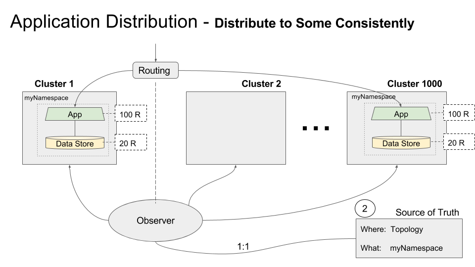

# Statically Distribute an Application Consistently across Specific Clusters using the FCP

This set up ensures that an application (a namespace and its contents) is deployed on specific clusters under the FCP "consistently" in that the namespace and all its API objects and the amount of replicas are the same across each of the specified clusters as illustrated below:




Assuming you have your kubernetes cluster running and federation control plane set up with each of your clusters joined to it already:

## Deploy your app

As a simple example, we will be deploying nginx.

### Create the NGINX ReplicaSets

The replicasets/nginx.yaml file declares the number of replica sets desired in total across a multicluster. Since we want to ensure that we are deploying an application consistently across some clusters, we will want to specify the number of replicasets in only the clusters we want to deploy to and also ensure that the total number of replica sets is reflected in the `spec:replicas`. If you have 3 clusters and want one replica in cluster-1 and one replica in cluster-3, you would make the `spec:replicas: 2`, if you would like 3 replica sets on each of those clusters, you would make the `spec:replicas: 6`. Any cluster you don't want to deploy to is left blank or min-max replicas can both be set to 0. In the following .yaml file, 3 replica sets will be deployed on two of three clusters that are joined to the FCP.

Open the file replicasets/nginx-cdsc.yaml with your text editor of choice.

```
apiVersion: extensions/v1beta1
kind: ReplicaSet
metadata:
  name: nginx
  annotations:
    federation.kubernetes.io/replica-set-preferences: |
        {
            "rebalance": true,
            "clusters": {
                "cluster-1": {
                    "minReplicas": 3,
                    "maxReplicas": 3,
                    "weight": 1
                },
                "cluster-3": {
                    "minReplicas": 3,
                    "maxReplicas": 3,
                    "weight": 1
                }
            }
        }
spec:
  replicas: 6 
  template:
    metadata:
      labels:
        app: nginx
    spec:
      containers:
        - name: nginx
          image: nginx:1.10
          resources:
            requests:
              cpu: 100m
              memory: 100Mi

```
Feel free to change the total number of replicas and how they are spread across clusters. When you have altered the replicasets/nginx-cdsc.yaml file appropriately, run

```
kubectl create -f replicasets/nginx-cdsc.yaml
```

#### Verify your replica sets

Ensure that each of your replica sets is ready

```
kubectl get rs -o wide --watch
```

#### List Pods

You can ensure that the number of replicas you desire is running in each pod with the following command:

```
CLUSTERS="cluster-1 cluster-2 cluster-3"
```
** Note, the cluster names can be found by running `kubectl config get-contexts`

```
for cluster in ${CLUSTERS}; do
  echo ""
  echo "${cluster}"
  kubectl --context=${cluster} get pods
done
```


### Create NGINX Service

This component creates the necessary `nginx` federation DNS entries in your DNS managed zone for each cluster. There will be A type DNS entries created for each zone, region, as well as a top level DNS A type entry that will resolve to all zones for load balancing.

```
kubectl create -f services/nginx-service.yaml
```

#### Verify

Wait and verify the service has all the external IP addresses listed:

```
kubectl get svc nginx -o wide --watch
```

#### List Services

```
for cluster in ${CLUSTERS}; do
  echo ""
  echo "${cluster}"
  kubectl --context=${cluster} describe services nginx
done
```

## NGINX

Once the `nginx` service has an IP address for each replica, open up your browser and try to access it via its
DNS e.g. [http://nginx.default.federation.svc.federation.com/](http://nginx.default.federation.svc.federation.com/). Make sure to replace `federation.com` with your DNS name.

## Add/Remove Specific Clusters

This can be accomplished by simply changing the minReplicas and maxReplicas in each cluster that you want to include.
For example, we can redistribute the original 6 replicas from cluster-1 and cluster-3 to cluster-1 and cluster-2 with the following command

```
kubectl annotate rs/nginx federation.kubernetes.io/replica-set-preferences='{"rebalance": true, "clusters": {"cluster-1": {"minReplicas": 3, "maxReplicas": 3, "weight": 0},"cluster-2": {"minReplicas": 3, "maxReplicas": 3, "weight": 0}}}'
```

### Extra Mongo App

The same replica set and service yaml files are available for mongo as well. If you are interested, you can try running the same commands as above (replace all instances of nginx with mongo) to see a mongo replica spin up on each of your clusters. Feel free to try the same process with your own app.


## Cleanup

Clean up your federation by following [these steps](./cleanup.md)


[Back to multi-cluster use cases](../README.md#multi-cluster-use-cases-1)

